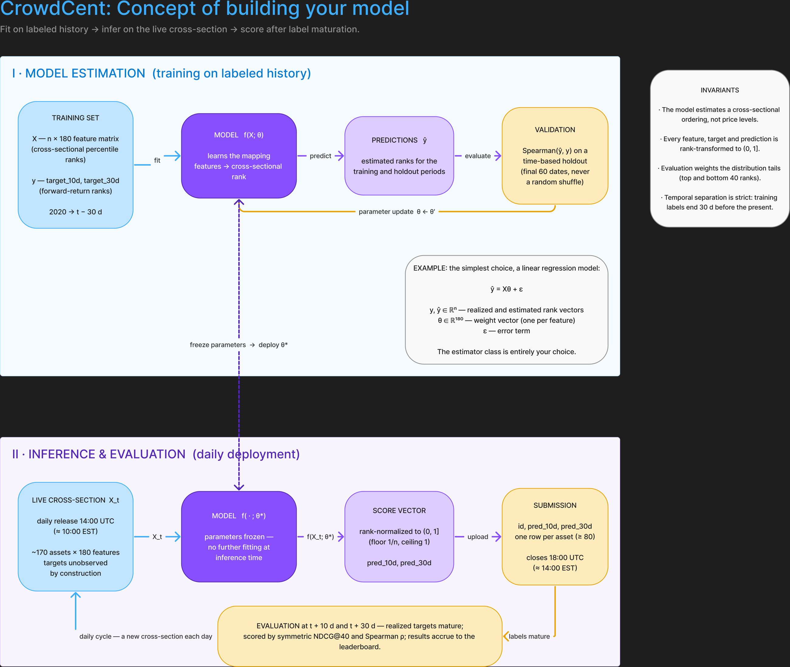

# CrowdCent dataset samples

Curious what the CrowdCent "Hyperliquid Ranking" challenge actually looks like?
You're in the right folder. Inside are **tiny 25-row samples** of every file the
challenge uses, plus plain-English notes.

## The whole game in four sentences

Every day, CrowdCent hands you a list of ~170 cryptocurrencies, each described by
180 anonymous measurements. Your job: predict which coins will do **best relative
to the others** over the next 10 and 30 days, the finishing order, not the prices.
You upload your predicted ranking; ten days later reality grades it.
Do it well, consistently, and you climb the leaderboard.

## The Concept and Flow



Stage I fits a model f(X; θ) on the labeled history and iterates parameter updates
against a time-based holdout. Stage II deploys the frozen parameters θ* on each
day's live cross-section, uploads the rank-normalized score vector, and is scored
once the labels mature at t + 10 d and t + 30 d.

## What's in this folder

| open this | to see |
|---|---|
| `1_training_data_sample25.md` | the "history book" your model learns from (with answers) |
| `2_inference_data_sample25.md` | "today's quiz" — same measurements, answers missing |
| `3_example_submission_sample25.md` | the answer sheet you upload, and how to read it as a portfolio |
| `*.parquet` files | the same 25 rows in the real file format (for code, not eyes) |

Read them in that order — history book → quiz → answer sheet — and you'll
understand the entire challenge in about five minutes.

## Why the training data stops ~30 days before today (label maturation)

Look at the newest `date` in the training sample and you'll notice it ends about a
month before the day the file was downloaded. That gap is not a policy choice — it
is structural, and it's worth understanding:

- `target_30d` for a row dated *d* is the asset's rank of **realized** returns over
  roughly *d+1 → d+31* (returns start from the close *after* the prediction time —
  a deliberate 1-day lag, since at 14:00 UTC only the previous 24:00 UTC close is
  known). The label for day *d* therefore cannot be computed until ~31 days later.
- Rather than shipping rows with empty target columns, CrowdCent cuts the training
  file where **both** labels are fully matured. You can verify this in the real
  data: a file downloaded in early September has its last training date in late
  July (a 32–35 day gap), and zero nulls in either target column across all
  ~195,000 rows.

Two consequences follow. First, temporal separation is enforced by construction —
the "answers" for the most recent month do not exist anywhere, including at
CrowdCent, so there is nothing to accidentally leak from their files. Second, the
guarantee covers *their* labels only: if you engineer your own features from
outside data sources, keeping future information out of row *d* becomes your
responsibility, joining anything computed after date *d* onto that row is the
classic way to get a brilliant backtest and a poor live score.

## Want to play?

1. Make a free account at [crowdcent.com](https://crowdcent.com) and grab an API key.
2. `pip install crowdcent-challenge`
3. Three lines of Python download the real files:

```python
from crowdcent_challenge import ChallengeClient
client = ChallengeClient(challenge_slug="hyperliquid-ranking")
client.download_training_dataset("latest", "training_data.parquet")
```

The docs at [docs.crowdcent.com](https://docs.crowdcent.com) take it from there.
Good luck! The leaderboard is friendlier than it looks. 🍀

*(One file isn't sampled here: the "meta-model": the blend of everyone's
predictions. Downloading it needs 100 leaderboard points first. Something to
unlock later!)*
