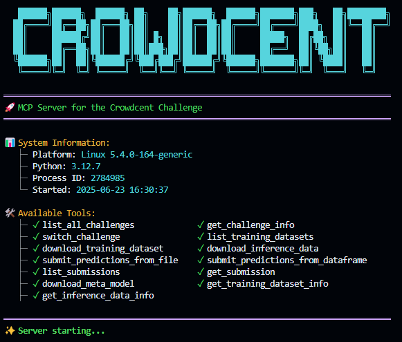

# Using AI Agents

CrowdCent provides a Model Context Protocol (MCP) server that enables direct interaction with the CrowdCent Challenge API from AI agents and assistants like Cursor or Claude Desktop. This allows you to use natural language to perform challenge-related-tasks such as downloading data, training models, and submitting predictions.

The MCP server is a separate, open-source project.

- **Repository**: [crowdcent/crowdcent-mcp](https://github.com/crowdcent/crowdcent-mcp)

[](https://github.com/crowdcent/crowdcent-mcp){:target="_blank"}


## Example Prompts

Once the server is running and your agent is configured, you can use natural language prompts.

**Example Prompts:**

```
"Download the latest CrowdCent training data and show me the first 5 rows."
```

```
"Submit predictions from 'predictions.parquet' to the CrowdCent challenge."
```

## Installation

1.  **Clone the server repository**:
    ```bash
    git clone https://github.com/crowdcent/crowdcent-mcp.git
    cd crowdcent-mcp
    ```

2.  **Install dependencies**:
    The project uses `uv` for package management.
    ```bash
    uv pip install -e .
    ```

## Configuration

### API Key

The MCP server requires your CrowdCent API key.

1.  Create a `.env` file in the `crowdcent-mcp` directory.
2.  Add your key to the file:
    ```
    CROWDCENT_API_KEY=your_api_key_here
    ```

You can get an API key from your [CrowdCent Account Page](https://crowdcent.com/account).

### Agent Setup

You'll need to point your AI agent to the local MCP server.

=== "Cursor"

    To integrate the MCP server with Cursor:

    1.  Open your Cursor settings (`~/.cursor/mcp.json` or through the UI).
    2.  Add the following server configuration:

        ```json
        {
          "mcpServers": {
            "crowdcent-mcp": {
              "command": "/path/to/your/uv",
              "args": [
                "run",
                "--directory", "/path/to/crowdcent-mcp",
                "server.py"
              ]
            }
          }
        }
        ```

=== "Claude Desktop"

    For Claude Desktop, add the following to your configuration file:

    -   **macOS**: `~/Library/Application Support/Claude/claude_desktop_config.json`
    -   **Windows**: `%APPDATA%\Claude\claude_desktop_config.json`
    -   **Linux**: `~/.config/Claude/claude_desktop_config.json`

    ```json
    {
      "mcpServers": {
        "crowdcent-mcp": {
          "command": "uv",
          "args": [
            "run",
            "--directory", "/path/to/crowdcent-mcp",
            "server.py"
          ]
        }
      }
    }
    ```

!!! warning "Use Absolute Paths"

    In all configurations, replace `/path/to/your/uv` and `/path/to/crowdcent-mcp` with the absolute paths on your system. For example, `uv` is often located at `~/.cargo/bin/uv`.


For detailed troubleshooting, please refer to the [crowdcent-mcp repository](https://github.com/crowdcent/crowdcent-mcp).