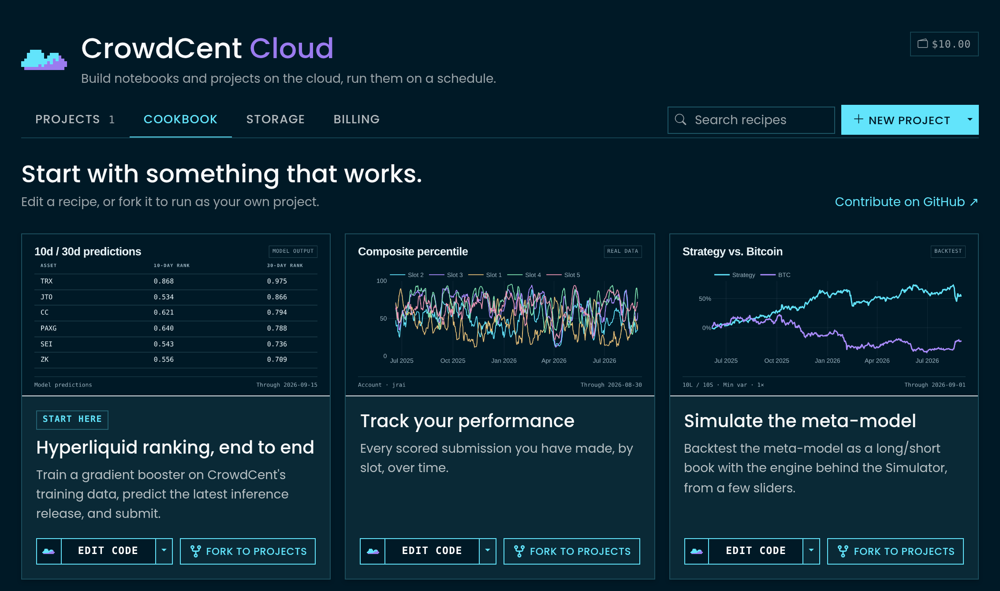
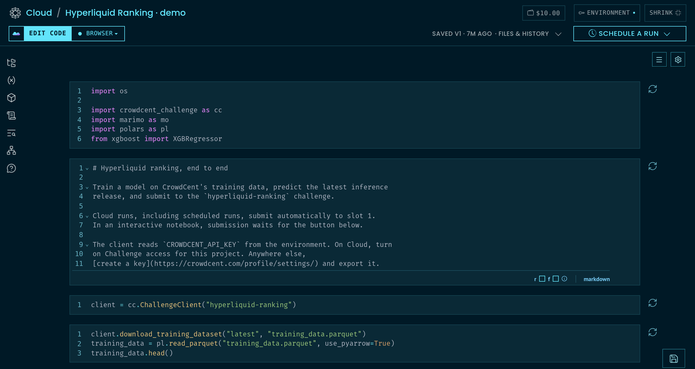
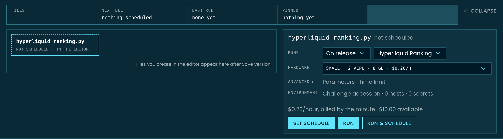

# CrowdCent Cloud

CrowdCent Cloud brings your code, saved models, and automated workflows into one project. Develop marimo notebooks and Python scripts in the Browser or a **Cloud Session**, then use **Cloud Runs** to execute saved code on demand or on a schedule.

CrowdCent Cloud is open to **anyone with a Challenge submission**. No submission yet? Run the `hyperliquid-ranking` recipe free in your browser from the [Cloud page](https://crowdcent.com/cloud/) to make your first one. Enable **Allow Cloud** on an API key to use the Python client or MCP tools.

## Overview

CrowdCent Cloud supports the standard competition workflow: develop and save code, then run it on dedicated compute or schedule it for later. Train models periodically and generate predictions daily or whenever a challenge releases new inference data.

Key features include:

- **Python projects.** Use marimo notebooks saved as `.py` files, ordinary Python scripts, and supporting project files. Declare dependencies inside the file with PEP 723 script metadata.
- **Choose how to work.** Edit interactively in the free Browser runtime or on hosted hardware with Cloud Sessions. Cloud Runs execute saved code unattended.
- **Schedule saved code.** Pin saved code and its execution settings without running it first, or reuse the settings from a successful Cloud Run. Later edits take effect only when you update the schedule explicitly.
- **Sandboxed isolation.** Common public APIs, package indexes, and model downloads are available automatically over HTTPS; other destinations require approval. Temporary, non-trading API credentials allow Challenge data downloads and prediction submissions without exposing account secrets.

<figure class="doc-screenshot" markdown>
[{ loading=lazy width="1134" height="671" }](https://crowdcent.com/cloud/recipes/){ target="_blank" rel="noopener" title="Open this page on CrowdCent" }
<figcaption>Open <strong>Cloud → Cookbook</strong> to start from a working example. <strong>Edit code</strong> opens a recipe; <strong>Fork to projects</strong> saves your own copy. The Hyperliquid baseline is marked <strong>Start here</strong>.</figcaption>
</figure>

## Core concepts

The website and API / Python / MCP share the saved-project and Cloud Run workflow. Use the website for live editing:

| Workflow | Website | API / Python / MCP |
|---|:---:|:---:|
| Projects, saved files, and versions | ✓ | ✓ |
| Cloud Runs and schedules | ✓ | ✓ |
| Live editing | ✓ | — |

| Concept | What it means |
|---|---|
| **Project** | Your code, generated files, version history, Cloud Runs, and per-file schedules in one folder. |
| **Version** | An immutable copy of saved project code and dependency declarations. A changed save creates the next version. |
| **Output snapshot** | A record of the whole generated-output folder at a point in time, including models and predictions. Its history is independent of code versions. |
| **Cloud Session** | A live Python kernel on hosted hardware, opened from the website. The free Browser runtime runs in your tab instead. |
| **Cloud Run** | An unattended execution of a saved version and named file on selected hardware. |
| **Schedule** | Clock, inference-release, or after-success triggers for a file's pinned code and execution settings. |
| **Recipe** | A starter notebook from the [CrowdCent Cookbook](https://github.com/crowdcent/crowdcent-cookbook). Forking a recipe creates your own project. |

## Browser and Cloud Sessions

Open a project on crowdcent.com to edit and execute its marimo notebook. Launch support covers marimo `.py` notebooks and Python scripts; Jupyter notebooks and JupyterLab are outside the launch scope.

When working locally or using an AI assistant via MCP, use your local development environment, then save files, start Cloud Runs, and configure schedules through the project API.

Use the menu beside **Edit code** to choose Browser or Cloud Session, switch hardware, or end your session.

<figure class="doc-screenshot" markdown>
[{ loading=lazy width="1280" height="680" }](https://crowdcent.com/cloud/){ target="_blank" rel="noopener" title="Open this page on CrowdCent" }
<figcaption>The project workspace puts code in the editor, the runtime beside <strong>Edit code</strong>, and <strong>Files &amp; history</strong> plus <strong>Run &amp; schedule</strong> on the right.</figcaption>
</figure>

### Browser runtime

The Browser runtime executes Python directly in your browser tab using WebAssembly via Pyodide and marimo.

- **Free compute.** Runs on your device without consuming Cloud compute credits.
- **Dependency installation.** Browser-compatible packages declared in your notebook install in the tab. Packages that require native Python may need a Cloud Session or Cloud Run.
- **Challenge data access.** Enabling the **Challenge access** toggle grants the session a temporary, short-lived token to read challenge datasets without exposing account credentials.

!!! warning "Browser memory and compute limits"
    The Browser runtime uses your device's CPU and browser memory. Large datasets and model training can exceed those limits. Use a **Cloud Session** or **Cloud Run** for workloads that need more memory or native Python packages.

### Cloud Sessions

Cloud Sessions run native Python on hosted CrowdCent hardware with the marimo editor.

- **Dedicated compute.** Suitable for heavier data transformations and local model training.
- **Usage billing.** Billed by the started minute at the selected size's hourly rate. The rate is displayed before you start.
- **Runtime switching.** Your project files move with you; the kernel restarts, so rerun cells to recreate in-memory variables. Files beyond the Browser transfer limits stay saved in the project.

| Size | vCPU | Memory | Accelerator |
|---|---|---|---|
| S | 2 | 5 GiB | |
| M | 4 | 16 GiB | |
| L | 8 | 48 GiB | |
| GPU | 14 | 54 GiB | one NVIDIA L4 24 GB |

GPU Cloud Sessions provide a 64 GiB temporary disk cache at `~/.cache`, deleted when the session ends. This is separate from the GPU's 24 GB of video memory and the session's system memory; downloading a model does not guarantee it will fit in memory.

### Session lifecycle and recovery

Use **Save version** to preserve code and generated files. Cloud Sessions also attempt to save when you click **End** or reach their idle or lifetime limit. A session stops after 5 hours with no typing and no code running (a long training job with its tab closed keeps it alive), and after 24 hours at most; the workspace warns before either and shows its limits. Your credits bound everything else. Conflicting saves are retained for recovery without replacing newer saved work. Save regularly: recovery depends on the session still being reachable.

With **Challenge access** enabled, Browser and Cloud Sessions can download Challenge data and submit predictions using a temporary key. Those keys cannot trade or start other Cloud resources. Use Cloud Runs for unattended submissions and scheduled workflows.

## Cloud Runs

Runs execute an immutable snapshot of your project in an isolated container. You can trigger a run manually from the workspace or programmatically via the API and MCP tools. Once queued, you can monitor execution status until completion.

| Size | vCPU | Memory | Accelerator |
|---|---|---|---|
| S | 2 | 8 GiB | |
| M | 4 | 16 GiB | |
| L | 8 | 32 GiB | |
| GPU | 16 | 64 GiB | one NVIDIA L4 24 GB |

Every size may run for up to a day; you can choose a shorter deadline. Startup time includes preparing hardware and installing declared dependencies, and varies with the workload.

### Notebook buttons and forms

Every manual or scheduled Cloud Run receives `CROWDCENT_RUN_ID` in its environment, but interactive notebook sessions do not. So, a recipe intended to submit unattended during a run can use this to pass its button gate during a run:

```python
import os

# In the submission cell; submit is a mo.ui.run_button from an earlier cell.
mo.stop(not os.environ.get("CROWDCENT_RUN_ID") and not submit.value)
```

The Cookbook's `hyperliquid_ranking` recipe uses this pattern to submit automatically to slot 1 during Cloud Runs. Cloud executes marimo notebooks with `marimo export html`; in the current runtime, `mo.running_in_notebook()` returns `True` and `mo.app_meta().mode` is `"edit"` even during a run. Use the run ID to distinguish unattended Cloud execution.

### Network and access control

Browser notebooks, Cloud Sessions, and Cloud Runs share a reviewed catalog of public HTTPS destinations. Common services such as GitHub, Hugging Face model and dataset downloads, Python package indexes, and market-data APIs are available automatically on port 443. You do not need to add those hosts to each project. A service may still require its own API key.

Existing schedules and schedules copied from a completed Cloud Run keep their saved network permissions; setting a schedule from saved code adopts the current defaults.

Request other destinations under **Environment → Network**. Private-network addresses and unapproved destinations remain blocked. Generic hosting and temporary tunnel domains are not approved as a whole; a specific endpoint can be reviewed separately.

Each Cloud Run normally has a **64 GiB network-transfer budget**; each Cloud Session has **128 GiB**. Both count your code's downloads and uploads, including dependency installation. In Cloud Runs, saving and restoring project files is handled by CrowdCent and does not use this budget. In Cloud Sessions, saving and restoring project files also counts. Each budget is reduced to the account's remaining monthly network allowance: 200 GiB for Challenger, 500 GiB for Contender, and 1,000 GiB for Centurion and Sovereign. Runs and sessions share that allowance, which resets on the first of the month at 00:00 UTC; active sessions reserve their authorized capacity until usage is measured or the session ends.

Browser notebooks use the same public-host catalog, with smaller request limits: 16 MiB uploads and 256 MiB responses through the Browser relay, plus your device's memory limits. Use a Cloud Session or Cloud Run for larger downloads.

Temporary downloads are separate from saved-project storage. A working dataset in a temporary directory or runtime cache uses disk space and network allowance, and is discarded when that runtime ends. Saving it as a project file also subjects it to the [saved-file and output limits](#safe-updates-and-concurrency). Transfer budgets do not increase saved-file limits or guarantee that a model fits in memory.

When the **Challenge access** option is enabled, the run receives a scoped, short-lived Challenge API key valid only for the duration of the run. This allows the notebook to fetch new inference data and post predictions to the challenge.

### Dependency management

Dependencies are declared at the top of your script or notebook using [PEP 723 inline script metadata](https://packaging.python.org/en/latest/specifications/inline-script-metadata/):

```python
# /// script
# dependencies = [
#     "polars>=1.0.0",
#     "lightgbm>=4.0.0",
#     "crowdcent-challenge",
# ]
# ///
```

Declare the packages your notebook imports so its environment can be recreated. Cloud Runs and Cloud Sessions read this metadata when preparing the notebook environment. Browser execution also requires those packages to be available for its browser-based Python runtime.

### A folder of scripts

A project is a tree of files, not one notebook. Pass the other files beside the entrypoint (`files={"download_data.py": ..., "submit.py": ...}` in the client, or drop them into the workspace); any `.py` or `.ipynb` in it, including one in a folder, runs by its path (`entrypoint="submit.py"`, `entrypoint="models/train.py"`), and the first run or schedule makes it a job of its own on the pipeline, which you can chain. A repository that says "run these three scripts in order" is one project, three jobs, and a daily chain.

### Hardware and time limits

Choose `s`, `m`, `l`, or `gpu_s`; the tables above show the resources for Cloud Runs and Cloud Sessions separately. Each size has the same hourly rate across both, with usage billed by the started minute.

A Cloud Run can run for up to 24 hours. You can set a shorter deadline. Starting requires enough available credits for an hour at the selected rate, or the chosen deadline if shorter; more credit is reserved as the run continues. Runs stop at their deadline or last funded minute. A stopped run can preserve its latest valid output checkpoint; check its report to see what was retained.

A GPU notebook declares its framework like any other dependency, `jax[cuda12]` for Keras on JAX (the `centimators` sequence models) or `torch`; the `gpu_s` machine carries the NVIDIA driver, and its own `xgboost` trains on the GPU with `device="cuda"` with nothing declared.

### Run reports

When a Cloud Run finishes, it produces an execution report containing:

- **State.** Current execution phase (`queued`, `running`, `done`, or `failed`).
- **Facts.** Recorded metadata including project version, hardware environment, and API permissions used.
- **Logs.** A bounded tail of stdout and stderr output.
- **Diagnostics.** Error details and stack traces if execution failed.
- **Artifacts.** Metadata for files generated during the run.

A status of `done` confirms that the script finished successfully within its time budget. To verify that predictions were accepted, check the challenge submissions dashboard or call `list_submissions` in the Python client.

### Parameters

Most runs need none. Parameters are for a notebook you launch several times with different settings, such as a tuning study.

Parameters are named values a run is told when it starts: `trials=100 lr_max=0.2`. Set them under **Advanced** on the Run form, or pass `parameters` to `run_cloud_project` or `schedule_cloud_project`. The run's code receives them as command-line arguments, `--trials=100 --lr_max=0.2`, which a marimo notebook reads with `mo.cli_args()` and a plain script with `sys.argv`. Numbers, `true`/`false`, and text are typed the way marimo types them. A run takes up to 32 parameters, named with lowercase letters, digits, and underscores.

For a form with complete defaults, a Cloud Run can use those defaults without parameters. Define `DEFAULTS` in the notebook and use it to initialize the form, then read the selected settings in a later cell:

```python
import os

answered = dict(mo.cli_args()) or search_form.value
mo.stop(
    not answered and not os.environ.get("CROWDCENT_RUN_ID"),
    mo.md("Choose a search and press **Tune**."),
)
search = {**DEFAULTS, **(answered or {})}
```

A Cloud Run with no parameters uses the defaults; a run told `trials=100` overrides that setting. An interactive notebook without arguments waits for the form. Runs use defaults saved in the code, not widget values changed in an interactive session. A run's parameters show on its report and beside it under History, scheduling the run keeps them, and `get_cloud_run` returns them as `parameters`.

```python
for trials, lr_max in [(60, 0.1), (60, 0.3), (120, 0.1)]:
    client.run_cloud_project(
        project["id"],
        envelope="l",
        time_limit_minutes=90,
        parameters={"trials": trials, "lr_max": lr_max},
    )
```

The executed notebook appears on the run report, and generated project files appear under History for later runs to read. The `optuna_tuning` recipe in the [CrowdCent Cookbook](https://github.com/crowdcent/crowdcent-cookbook) is a complete example. It runs up to two Optuna trials concurrently. Choose parallelism in your code to suit the selected hardware.

## Automated schedules

Schedule any saved executable file directly; no earlier run is required. The schedule pins the selected code version, file, hardware, parameters, and project access settings. Creating it starts no compute and reserves no credits. A trigger starts a Cloud Run, whose compute usage is billed normally.

With the Python client or MCP, omit `run_id` to schedule saved code. The defaults are the current saved version, primary file, S hardware, and the project's network, Challenge-access, and output settings. Or supply a successful `run_id` (`state: done`) to reuse that run's exact tested settings; do not combine it with execution-setting arguments.

A schedule holds the code version it was set with. Editing or saving new code does not
change it; the project's schedule state then reads `behind: true`, and the website shows
**Use vN** beside the rule. Either call `schedule_cloud_project` again to pin the newer
version, or set `follow_head=True` (the website's **Always run my newest save** switch) so
every fire runs the newest saved version. Data files are never pinned: every run reads
the project folder as it stands when it starts, so a model the optimizer wrote an hour
ago is what the inference job loads. `get_cloud_project` lists every runnable file under
`jobs`, whether or not it has run yet. `behind` is per file: editing `predict.py` does not
put `train.py`'s schedule behind.

Runs move through `queued` or `preparing` (before a machine), `starting` (the machine
coming up, usually one to three minutes), `running` (your code), then `done`, `failed`,
`timed_out` or `canceled`; `detail` says the same in words. `list_cloud_runs(project_id)`
lists them newest first; `stop_cloud_run(run_id)` cancels one that has not started at once
(nothing charged) or asks a running one to stop. Repeating `run_cloud_project` with the same
`idempotency_key` returns the original run and is never throttled; only new runs count
against the ten-a-minute run budget.

Every client exception carries `status_code`, `code` (the API's error code, such as
`VERSION_CONFLICT` or `FILES_CONFLICT`), `fields` (per-field validation detail) and
`payload`; the field detail is also in the message.

On the website, open **Run & schedule** in the project toolbar. Choose **On release** under **Runs**, select the challenge, review the hardware, and use **Set schedule** to save the rule.

<figure class="doc-screenshot" markdown>
[{ loading=lazy width="1280" height="355" }](https://crowdcent.com/cloud/){ target="_blank" rel="noopener" title="Open this page on CrowdCent" }
<figcaption><strong>Set schedule</strong> arms future runs; <strong>Run</strong> starts compute immediately. Review the selected file, trigger, and hardware before choosing either.</figcaption>
</figure>

### Supported triggers

- **Daily.** Runs every day at a specified `HH:MM` time in your chosen IANA timezone.
- **Weekly.** Runs once a week on a weekday (`0`=Mon … `6`=Sun) at `HH:MM`.
- **Monthly.** Runs on day `1`–`31` at `HH:MM`. Months without that date are skipped; February 29 runs in leap years.
- **On inference release.** Runs automatically whenever the target challenge publishes a new inference dataset.
- **After.** Runs when another job in the same project succeeds. The downstream file does not need an earlier run of its own.

Schedules can be paused and resumed at any time without needing to recreate the configuration.

## Credits and billing

Cloud Sessions and Cloud Runs consume Cloud credits. Centaur also uses this
balance if you enable paid asks after its included allowance.

- **Unified credit balance.** Accounts maintain a balance measured in integer cents (`available_cents`).
- **Included tier allowance.** Accounts receive a monthly credit allowance based on their tier. A reservation uses included credits when they cover it; otherwise it uses purchased credits.
- **One rate per machine.** Each size has the same hourly rate for Cloud Runs and Cloud Sessions, billed by the started minute. Credits are reserved up to an hour ahead of use; unused reservations are released when compute stops.
- **Low balance handling.** Insufficient credits prevent new compute. The API returns HTTP `402 CREDITS_REQUIRED` with a direct URL to add credits.

| Tier | CC Points | Included credits per month |
|---|---:|---:|
| Starter | any, with a submission | $2.50 |
| Challenger | 100+ | $10 |
| Contender | 500+ | $25 |
| Centurion | 1,500+ | $50 |
| Sovereign | 5,000+ | $100 |

Included credits reset on the first of each month at 00:00 UTC and do not roll
over. The month's allowance is set when you first reserve included credits that
month; later tier changes apply to the next month's allowance. Your current
allowance and remaining balance are shown under **Billing**. Purchased credits
are tracked separately from the monthly allowance.

```python
billing = client.get_cloud_billing()
billing["available_cents"]              # Total available balance (included + purchased)
billing["included"]["remaining_cents"]  # Monthly allowance remaining
billing["prices"]                       # Per size: hourly_cents, run_max_seconds
```

## Creating and managing projects

In the web interface, open **Cloud** to manage your projects.

- **New project.** Create a blank project in the Browser or Cloud runtime, import a repository from GitHub, fork a recipe from the Cookbook, or generate a starting point using Centaur.
- **Cookbook recipes.** Browse reviewed templates (such as `hyperliquid-ranking` or `numerai-dashboard`) to preview code or fork into your account.
- **Archiving projects.** Archiving hides a project from your active list, pauses its schedules, and ends its Cloud Sessions. Restoring it leaves schedules paused until you resume them.
- **Deleting projects.** Projects with recorded run history or billed session time must be archived to preserve their records. A project with no retained execution evidence can be deleted if no other project uses its output store.

## Python client and MCP tools

The Python client and MCP tools manage **project files, Cloud Runs, and schedules**. Create projects, read and edit saved files, download models, execute saved code, inspect results, and automate the next run.

Open live Browser and Cloud Sessions on the website. Centaur can work in that live workspace; an external API or MCP agent works with saved project files and Cloud Runs.

Complete method documentation is available in the [Python API reference](api-reference/python.md) and the [AI Agents (MCP) guide](ai-agents-mcp.md). REST endpoints are documented under the `cloud` tag in the [OpenAPI specification](https://crowdcent.com/api/swagger-ui/#/cloud).

### Python quickstart

```python
from crowdcent_challenge import ChallengeClient

client = ChallengeClient("hyperliquid-ranking")

# Create a tuning project from a Cookbook recipe
project = client.create_cloud_project(
    "Weekly model optimization",
    recipe="optuna-tuning",
    challenge_access=True,
)

# Pin saved code for Monday at 02:00 UTC; no training runs now.
client.schedule_cloud_project(
    project["id"],
    entrypoint=project["filename"],
    envelope="m",
    time_limit_minutes=90,
    parameters={"trials": 100},
    trigger="weekly",
    weekday=0,
    daily_at="02:00",
    timezone="UTC",
)
```

If you have already tested a Cloud Run and want to reuse its exact settings,
pass its ID instead of execution settings:

```python
run = client.get_cloud_run(successful_run_id)
assert run["state"] == "done"
client.schedule_cloud_project(
    run["project"], run["id"],
    trigger="weekly", weekday=0, daily_at="02:00", timezone="UTC",
)
```

### Safe updates and concurrency

Saving file edits via `update_cloud_project` requires specifying `base_version`, the version number your edit was based on. If another session or agent has saved a newer version, the request returns HTTP `409 VERSION_CONFLICT`. This prevents unintended overwrites.

```python
project = client.get_cloud_project(project["id"])

client.update_cloud_project(
    project["id"],
    files={project["filename"]: new_source, "helpers/features.py": helper_source},
    base_version=project["latest_version"],
)
```

Read files with `get_cloud_project_files(project_id, path="helpers/features.py")`.
`files` updates only the named paths; use `None` to delete. Other files, including
binary inputs, remain unchanged. A rename is a deletion and addition in one edit.
Use `filename` when changing which file is the primary notebook.

Code versions and generated-output snapshots are independent. A saved schedule
pins saved code; each occurrence reads the output snapshot current when the
run is created. An optimizer can write `models/best.joblib`, and a later prediction
script can load it from the same path. Clock and `after` triggers are alternatives:
either can start the job. They do not mean “wait for both.” An `after` run reads the
current output snapshot, which may include a newer publication than its triggering run.

File listings return immutable `version` or `snapshot` selectors. Supply one when
reading or downloading a model to reproduce the listed bytes:

```python
files = client.get_cloud_project_files(project["id"])
model = next(item for item in files["files"] if item["path"] == "models/best.joblib")
client.download_cloud_project_file(
    project["id"], model["path"], "best.joblib", snapshot=model["snapshot"],
)
```

Put data files into the project folder without the bytes passing through the API.
Give `upload_cloud_project_files` local paths (or `bytes`) keyed by their project
path; it describes the files, uploads what the folder does not hold yet straight to
storage, and returns once they are recorded. Code (`.py`/`.ipynb`) is refused here:
save it with `update_cloud_project(files=...)`.

```python
answer = client.upload_cloud_project_files(
    project["id"], {"models/best.joblib": "best.joblib", "data/features.parquet": "features.parquet"},
)
print(answer["snapshot"], answer["files"])
```

Without `baseline` the upload writes over the folder's current copy. Pass
`baseline={path: sha256}` from a listing to be refused (`409 FILES_CONFLICT`) if a
file changed since you read it. `deleted=[...]` removes folder paths. The REST shape
is one endpoint, `POST /api/cloud/projects/{id}/files/uploads/`, called until its
`uploads` list is empty; the MCP tool of the same name takes local paths and is
available in local stdio only. On the website, **Files & history → Upload…** does the
same for files on your computer.

Cloud Sessions and Cloud Runs support output files up to **50 GiB**, with at most
**50 GiB across all files in one output snapshot**, subject to the account's
retained-storage allowance. Cloud Session saves and restores also use the session's
remaining transfer budget. The Browser workspace holds data files up to 32 MB each
(200 MB in all) in the tab; larger files stay in the project folder for runs and
sessions and are marked **Cloud only** in that workspace. Current output paths remain
available; superseded snapshots follow retention limits, so history
is not permanent model retention. Keep separately named model files when both
models must remain in the current folder.

An open Browser or Cloud workspace retains its own files when the API saves a
new version. Its saved status offers **Save my workspace**, **Load saved version**,
and **Review differences**. Loading preserves the local code in history first;
overwriting still checks that the reviewed remote version has not changed again.
Unchanged local model files never republish over newer remote models. Conflicting
output edits are retained in a snapshot without moving the current output folder.

### Project storage

`get_cloud_project(project_id)["storage"]` reports retained bytes for that project.
`get_cloud_billing()["storage"]` reports the account's `used_bytes`, `limit_bytes`,
`included_bytes`, `remaining_bytes`, and a `projects` breakdown, including archived projects.
Archiving preserves files and does not free storage.

Project `used_bytes` is `source_bytes + output_bytes`. Each distinct saved source
archive counts by its stored size. Identical output blobs count once within a
project, even when several paths or snapshots reference them. `current_output_bytes`
counts outputs referenced by current snapshots; `history_bytes` counts the remaining
retained output bytes, excluding code archives. Browser memory and runtime disk
space are separate from this saved-project allowance.

Included retained storage is 1 GiB for Starter, 10 GiB for Challenger, 25 GiB for Contender, 50 GiB
for Centurion, and 100 GiB for Sovereign. You can explicitly enable
extra storage, up to 200 GiB across the account, with a monthly spending cap:

```python
billing = client.update_cloud_billing(storage_monthly_limit_cents=500)  # $5 cap
print(billing["storage"]["billing"])
```

Extra bytes cost $0.05 per GiB per 30 days, prorated by size and elapsed time.
Charges use included credits first, then purchased credits; fractional cents
carry between billing checkpoints. The spending cap resets on the first of each
month at 00:00 UTC. When the cap or available credits are exhausted, new storage
growth is blocked; existing files remain available to read, download, or prune.
Unfunded time does not become a debt charged after a later top-up.

The matching `update_cloud_billing` MCP tool and `PATCH /cloud/billing/` accept
the same `storage_monthly_limit_cents` value. These settings never buy credits.
To disable extra storage, first reduce usage to the included allowance, then
set the limit to zero. The response's `storage.billing` reports the current cap,
charges, rate, and any reason growth is blocked.

To permanently remove unused output history, explicitly request pruning through
the existing project-update method or matching MCP tool:

```python
project = client.update_cloud_project(project_id, prune_history=True)
print(project["storage"])
```

Send `prune_history=True` without other update fields. Pruning retains current
outputs, all code versions, and outputs needed by active runs, so `history_bytes`
is not necessarily the amount it can reclaim. End Cloud Sessions using the output
folder first; pruning is refused while they are active. Ordinary saves and updates
do not trigger this destructive cleanup automatically.

Between cleanups, history keeps **each file's current copy and its previous one**, so a
daily job that rewrites a 100 MB parquet holds 200 MB of history, not thirty copies.
`update_cloud_project(project_id, history_keep=5)` keeps the last five copies of each
file, `history_keep=None` keeps everything; the website has the same choice under
**Files & history → Storage & file settings → History keeps**. Files a running Run or
Session uses and the last 24 hours are kept regardless, and code versions always are.

### Idempotent requests

Calls to `create_cloud_project` and `run_cloud_project` include an auto-generated idempotency key so network retries cannot accidentally create duplicate projects or launch unintended runs. You can also supply a custom `idempotency_key` argument when implementing custom retry loops.

### Using AI assistants

AI tools connected via the CrowdCent MCP server can manage the Cloud workflow through matching tool names (`create_cloud_project`, `run_cloud_project`, `get_cloud_run`, etc.).

The hosted MCP server reads project text and file metadata. To download a binary
model to your computer, use Python, REST, or the local MCP server's
`download_cloud_project_file` tool.

```
"Create a Cloud project from the hyperliquid-ranking recipe, run it, and verify the output. If the run succeeds, schedule it on each inference release."
```

### Centaur in Cloud

Centaur helps you edit notebooks and project files, run code, inspect results,
and manage Cloud Runs and schedules. In an open notebook, it works in your live
workspace; **Save version** preserves those edits.

| | |
|---|---|
| **On its own** | reads your projects, runs, data and trading; edits notebooks and files; creates and archives projects; configures schedules when asked |
| **Asks first** | launches paid Cloud Runs · submissions (predictions, your Challenge key) · storage spending and permanent history removal (always asks) · trading (real money, always asks) |
| **Never** | buy credits or change your login or API keys |

Cloud Run launches and submissions have approval switches in the panel. When enabled, that action can proceed without another card; otherwise Centaur waits for your response. Unanswered cards expire without executing the action. Submissions are enabled by default. Trading, changes to storage spending, and permanent removal of output history always require confirmation. The panel also shows capabilities that are unavailable, such as Challenge access disabled for the project.

Scheduled Cloud Runs consume credits when they execute; configuring a schedule does not show a separate approval card. Code Centaur executes in an attached workspace has that workspace's filesystem and permitted network access.

## Security and permissions

Python/REST API and MCP access requires an API key with **Allow Cloud** enabled in [profile settings](https://crowdcent.com/profile/settings/). On the website, sign in with an eligible account.

- **Privilege separation.** Temporary keys issued to Cloud Runs and sessions cannot place trades. Keep your own development and automation API keys separate from trading-enabled keys.
- **Recursive prevention.** Scoped tokens provisioned for runs and interactive sessions cannot spawn secondary Cloud resources or modify billing settings.
- **Authentication check.** Call `client.check_auth()` to inspect the capabilities enabled on your current API key.
