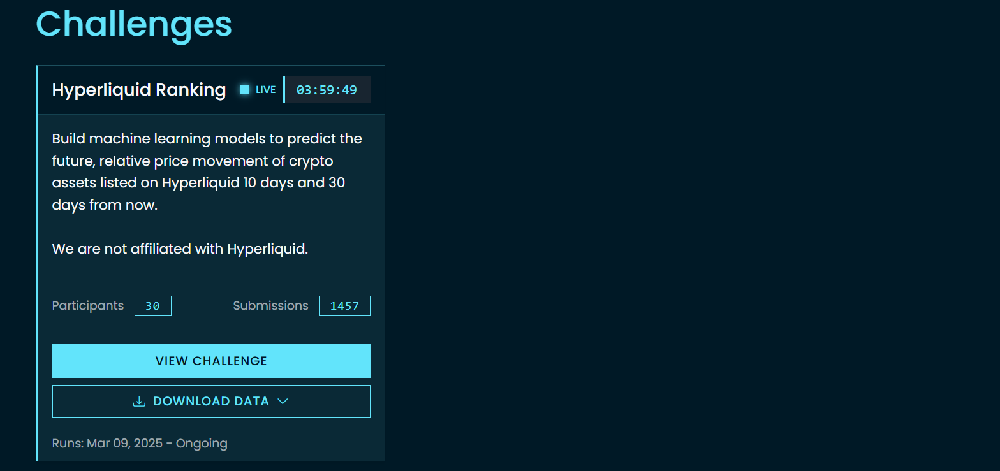
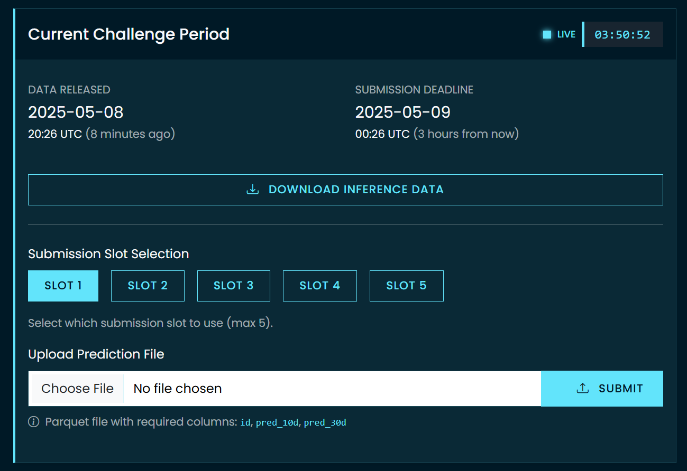
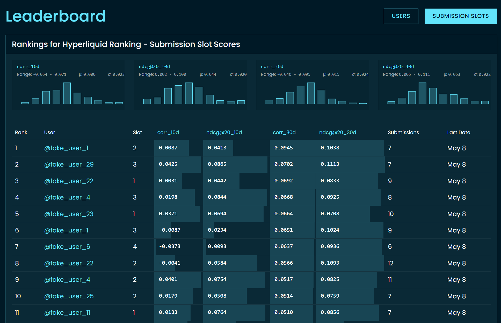
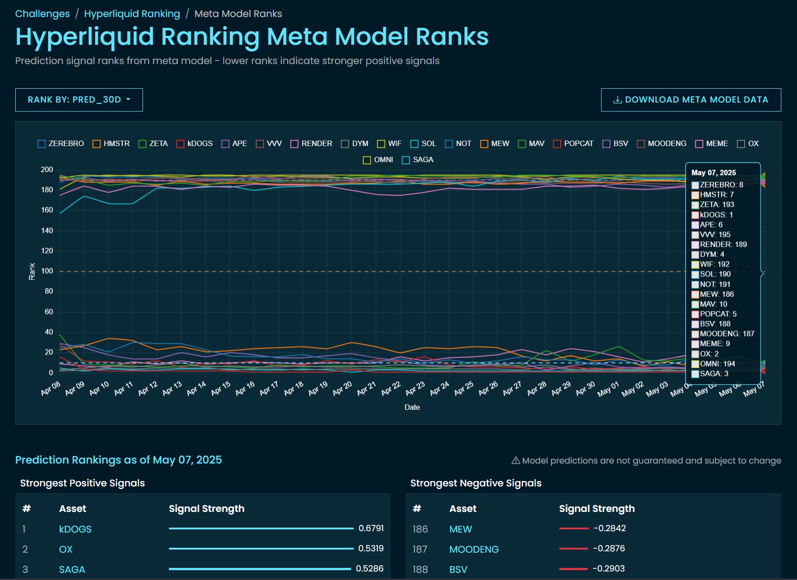

## Register for a CrowdCent account
Sign up for a CrowdCent account [here](https://crowdcent.com/accounts/signup/) or sign in with your GitHub account. We require an email verification step to ensure the account is real. If you'd like to work with the challenge programmatically, you'll need to generate an API key from your [user profile](https://crowdcent.com/profile). See the [client quickstart](install-quickstart.md) for more details.

## Explore Challenges
Once logged in, you'll land on the [Challenge List](https://crowdcent.com/challenge) page. Browse through the available challenges to find one that interests you. Each challenge card will give you a brief overview. Click on a challenge to see more details.

{:target="_blank"}

## Download Data
On the detail page for your chosen challenge (e.g. [hyperliquid-ranking](https://crowdcent.com/challenge/hyperliquid-ranking)), you will find:

- A section to download the latest **Training Data**. You'll need this to train your model.
- Information about the current or most recent **Inference Data** period. If a period is active, you can download the inference features here.

## Build a Model
Using the downloaded training data, build a model to predict the challenge target(s). You can refer to our tutorial notebooks (if available in the challenge description or docs) for examples.

## Submit predictions during an Inference Period
- The Challenge Detail page will display information about the current **Inference Data** period, including its release date and submission deadline.
- You have a specific number of **submission slots** (e.g., up to 5) for each inference period. You can choose which slot to use for each submission.

{:target="_blank"}
*The submission panel on the Challenge Detail page shows inference periods and your submission slots. In this submission panel image, we see that slots 1, 2, and 3 have successful submissions for the current inference period (lower-right check marks). However, only slots 1 and 3 have queued submissions for the next inference period (upper-right squares)*

There are two main ways to submit your predictions:

### 1. Via the Website (UI)
- Go to the Challenge Detail page.
- In the submission panel, select an available **slot**.
- Upload your prediction file (typically a Parquet file).
- **Submissions are now flexible:**
    - If the window is **open**, your file is submitted immediately. By default, it is also queued for the *next* period (auto-rollover).
    - If the window is **closed**, your file is **queued** and will be automatically submitted when the next period opens.

### 2. Programmatically (via API)
- Go to your **User Profile** page (accessible from the top navigation bar when logged in).
- In the "API Keys" section, you can generate a new API key. Give it a descriptive name. **Store this key securely as it will not be shown again.**
- Use this API key with the `crowdcent-challenge` Python package to submit your predictions. 
- The client supports the same flexible behavior: submitting during an open window will also queue for the next period by default (`queue_next=True`). Submitting during a closed window will automatically queue.

See our [client quickstart guide](install-quickstart.md) for more details.

### 3. Via AI Agents (MCP Server)
It's also possible to interact with challenges using AI agents like Cursor or Claude Desktop. This provides a natural language interface for downloading data, submitting, and more. See our [AI Agents (MCP) guide](ai-agents-mcp.md) for setup instructions.

## Wait for Scores
After an inference period's submission deadline passes, predictions will be evaluated. Your submission status and scores will be updated on your profile and the challenge leaderboard.

For more details on how scores are calculated and what the scores mean, see the [Scoring](scoring.md) page.

## Check the Leaderboard
Navigate to the [Leaderboard](https://crowdcent.com/leaderboard) page to see how your submissions rank against other participants for each challenge. You can switch the leaderboard by challenge, sort by different scores, and view results by user or by individual submission slots.

{:target="_blank"}

## Watch the Meta-Model
For some challenges, the meta-model is published after an inference period ends. For now, this is only available for the [hyperliquid-ranking](https://crowdcent.com/challenge/hyperliquid-ranking) challenge and may be subject to change. The meta-model represents relative signals for the investable universe.

!!! warning "Meta-Model Disclaimer"
    The meta-model represents CrowdCent's aggregation of participant submissions into a single model. While we strive to create robust meta-models, please note:

    - Meta-models are provided for informational purposes only and should not be construed as investment advice
    - Past performance of meta-models is not indicative of future results
    - Meta-model methodologies may change over time without notice

{:target="_blank"}
