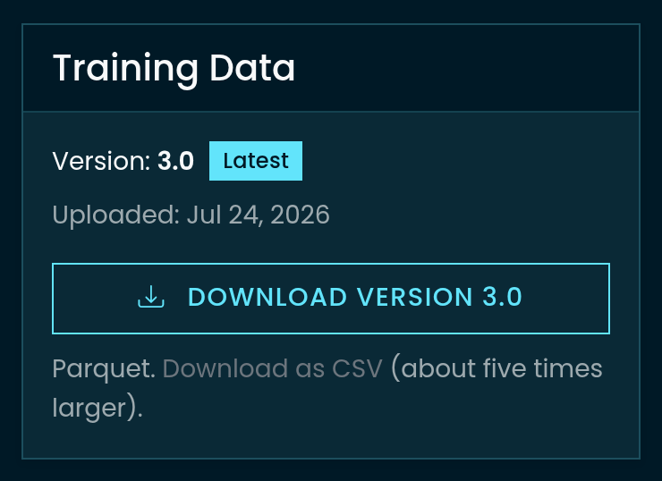
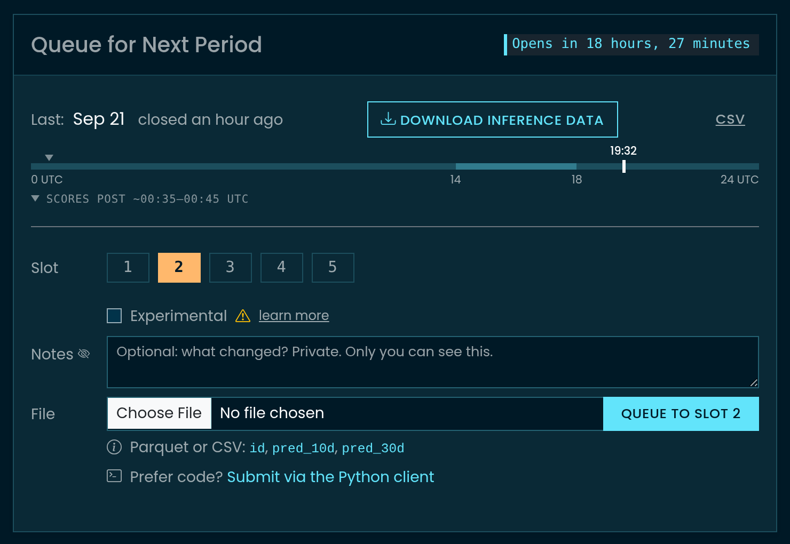
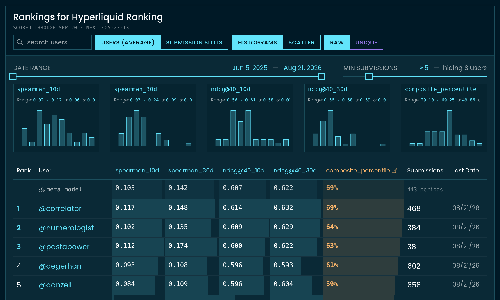
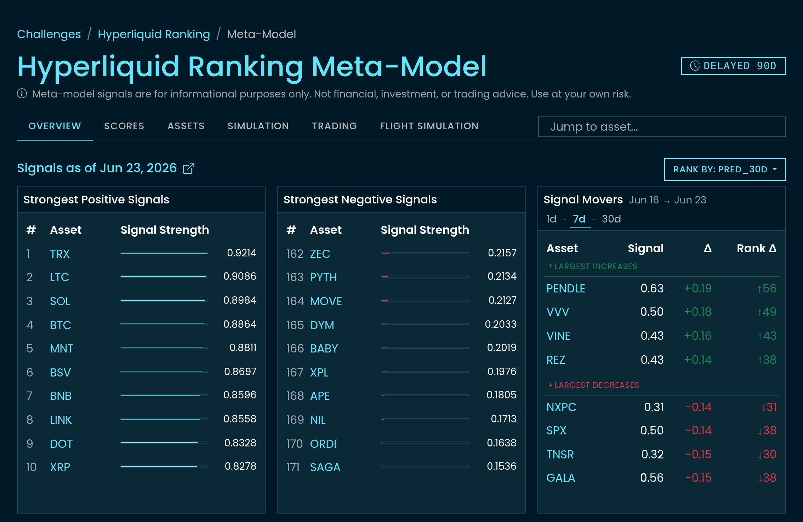

# Getting Started

Follow the path from downloading data to checking your model’s scores. Select any screenshot to open the related page on CrowdCent; dates, rankings, and balances are examples.

## Register for a CrowdCent account
Sign up for a CrowdCent account [here](https://crowdcent.com/accounts/signup/) or sign in with your GitHub account. We require an email verification step to ensure the account is real. If you'd like to work with the challenge programmatically, you'll need to generate an API key from your [profile settings](https://crowdcent.com/profile/settings/). See the [client quickstart](install-quickstart.md) for more details.

## Explore Challenges
Once logged in, you'll land on the [Challenge List](https://crowdcent.com/challenge) page. Browse through the available challenges to find one that interests you. Each challenge card will give you a brief overview. Click on a challenge to see more details.

## Download Data
On the detail page for your chosen challenge (e.g. [hyperliquid-ranking](https://crowdcent.com/challenge/hyperliquid-ranking)), you will find:

- A section to download the latest **Training Data**. You'll need this to train your model.
- Information about the current or most recent **Inference Data** period. If a period is active, you can download the inference features here.

<figure class="doc-screenshot doc-screenshot--compact" markdown>
[{ loading=lazy width="370" height="269" }](https://crowdcent.com/challenge/hyperliquid-ranking/){ target="_blank" rel="noopener" title="Open this page on CrowdCent" }
<figcaption>Use the <strong>Training Data</strong> card for model training. The submission panel has a separate <strong>Download inference data</strong> link for the prediction universe.</figcaption>
</figure>

## Build a Model
Using the downloaded training data, build a model to predict the challenge target(s). You can refer to our tutorial notebooks (if available in the challenge description or docs) for examples.

## Submit predictions during an Inference Period
- The Challenge Detail page will display information about the current **Inference Data** period, including its release date and submission deadline.
- You have multiple **submission slots** for each inference period (currently up to 5 for Hyperliquid Ranking). You can choose which slot to use for each submission.

<figure class="doc-screenshot" markdown>
[{ loading=lazy width="740" height="510" }](https://crowdcent.com/challenge/hyperliquid-ranking/){ target="_blank" rel="noopener" title="Open this page on CrowdCent" }
<figcaption>Read the window status first, then choose a slot and file. This closed-window example shows <strong>Queue to slot 2</strong>; during an open window, the action submits to the current period.</figcaption>
</figure>

Choose the submission workflow that suits you:

### 1. Via the Website (UI)
- Go to the Challenge Detail page.
- In the submission panel, select an available **slot**.
- Upload your prediction file (typically a Parquet file).
- **Submissions are flexible:**
    - If the window is **open**, your file is submitted immediately. By default, it is also queued for the *next* period (auto-rollover).
    - If the window is **closed**, your file is **queued** and will be automatically submitted when the next period opens.
- **Mark a submission as experimental** to test new models without affecting your leaderboard rank, CC Points, or meta-model contribution. Experimental submissions are still scored and shown on profiles with an **experimental** label (triangular slot badge). You must keep at least one non-experimental submission in another slot for the same period.
- **Add a note** (e.g. *"added sector features"*) so future-you remembers what changed. Notes are private to you and editable any time.

### 2. Programmatically (via API)
- Go to your profile's **Settings** tab ([https://crowdcent.com/profile/settings/](https://crowdcent.com/profile/settings/)).
- In the **API credentials** panel, click **New Key**, enter a name, and click **Create**. **Store this key securely as it will not be shown again.**
- Use this API key with the `crowdcent-challenge` Python package to submit your predictions. 
- The client supports the same flexible behavior: submitting during an open window will also queue for the next period by default (`queue_next=True`). Submitting during a closed window will automatically queue.

See our [client quickstart guide](install-quickstart.md) for more details.

### 3. Via AI Agents (MCP Server)
AI assistants like Claude Code and Cursor can drive the whole loop in natural language: download data, train and submit a model, and backtest the meta-model. Connect the hosted MCP server at `mcp.crowdcent.com` with your API key (nothing to install), or run it locally with one `uvx` line. See the [AI Agents (MCP) guide](ai-agents-mcp.md) for setup.

## Wait for Scores
After an inference period's submission deadline passes, predictions will be evaluated. Your submission status and scores will be updated on your profile and the challenge leaderboard.

For more details on how scores are calculated and what the scores mean, see the [Scoring](scoring.md) page.

## Check the Leaderboard
Navigate to the [Leaderboard](https://crowdcent.com/leaderboard) page to see how your submissions rank against other participants for each challenge. You can switch the leaderboard by challenge, sort by different scores, and view results by user or by individual submission slots.

The leaderboard has two views toggled by the **Raw / Unique** buttons:

- **Raw**: How accurate your predictions are against actual outcomes (NDCG@40, Spearman)
- **Unique**: How differentiated your predictions are from the meta-model and how predictive that unique signal is

<figure class="doc-screenshot" markdown>
[{ loading=lazy width="1110" height="668" }](https://crowdcent.com/leaderboard/){ target="_blank" rel="noopener" title="Open this page on CrowdCent" }
<figcaption>Use <strong>Users (average)</strong> for participant rankings or <strong>Submission slots</strong> for individual models. Set the date range and minimum submissions before comparing scores.</figcaption>
</figure>

## Watch the Meta-Model
For some challenges, the meta-model is published after an inference period ends. For now, this is only available for the [hyperliquid-ranking](https://crowdcent.com/challenge/hyperliquid-ranking) challenge and may be subject to change. The meta-model represents relative signals for the investable universe.

!!! info "Meta-Model Access"
    Real-time meta-model predictions require **Challenger** tier or above (100+ [CC Points](points-system.md)) and active participation, meaning at least one submission in the last 30 days. All users can access 90-day delayed predictions and full performance scores.

!!! warning "Meta-Model Disclaimer"
    The meta-model represents CrowdCent's aggregation of participant submissions into a single model. While we strive to create robust meta-models, please note:

    - Meta-models are provided for informational purposes only and should not be construed as investment advice
    - Past performance of meta-models is not indicative of future results
    - Meta-model methodologies may change over time without notice

<figure class="doc-screenshot" markdown>
[{ loading=lazy width="1134" height="739" }](https://crowdcent.com/challenge/hyperliquid-ranking/meta-model/){ target="_blank" rel="noopener" title="Open this page on CrowdCent" }
<figcaption>Check the <strong>signal date</strong> and <strong>Delayed 90D</strong> badge before reading the rankings. <strong>Rank by</strong> switches the prediction horizon; <strong>Scores</strong> and <strong>Simulation</strong> answer different questions about the same aggregate signal.</figcaption>
</figure>

## Simulate the Meta-Model

Once the meta-model is published, put it to work: the [Simulator](simulator.md) turns it into long/short Hyperliquid portfolios you can backtest, sweep, and blend, no code required. Your [CC Points](points-system.md) unlock more of it tier by tier. When a construction survives, [Live Trading](live-trading.md) deploys it as a mandate on your own Hyperliquid account (Challenger tier and above).
