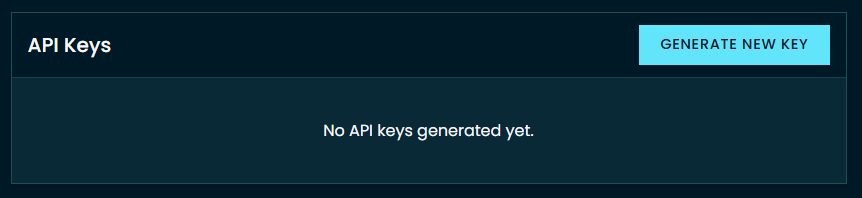

## Install the client
=== "Using uv (Recommended)"

    ```bash
    uv add crowdcent-challenge
    ```

=== "Using pip"

    ```bash
    pip install crowdcent-challenge
    ```

## Get an API Key

You need an API key to use the CrowdCent Challenge API. You can get your key by clicking "Generate New Key" on your [profile page](https://crowdcent.com/profile). Write it down, as you won't be able to access it after you leave the page.

[](https://crowdcent.com/profile){:target="_blank"}

## Authenticate and Initialize the Client

The API client requires authentication using your API key. This can be provided directly or via environment variables. You can interact with the API using the Python client or the CLI.

=== "Python"

    ```python
    from crowdcent_challenge import ChallengeClient, CrowdCentAPIError

    challenge_slug = "hyperliquid-ranking"  # Replace with your challenge
    api_key = "your_api_key_here" # Replace with your actual key
    client = ChallengeClient(challenge_slug=challenge_slug, api_key=api_key)
    ```

=== "CLI"
   
    ```bash
    export CROWDCENT_API_KEY=your_api_key_here # Set the environment variable
    echo "CROWDCENT_API_KEY=your_api_key_here" > .env # or create .env

    # Set the default challenge
    crowdcent set-default-challenge hyperliquid-ranking

    # Check current default challenge
    crowdcent get-default-challenge
    ```
    !!! note
        With a default challenge set, you can run most commands without explicitly specifying the challenge. If you need to override the default for a specific command, use the `--challenge` or `-c` option.

## Training Data

Access training datasets for a challenge, including listing available versions, getting the latest version, and downloading datasets.

=== "Python"

    ```python
    # List all training datasets for the current challenge
    client.list_training_datasets()

    # Get details about the latest training dataset
    client.get_training_dataset("latest")

    # Download the training dataset file
    version = "latest" # or specify a version like `1.0`
    output_path = "data/training_data.parquet"
    client.download_training_dataset(version, output_path)
    ```

=== "CLI"

    ```bash
    # List all training datasets
    crowdcent list-training-data

    # Get details about a specific training dataset version
    crowdcent get-training-data 1.0

    # Download latest version
    crowdcent download-training-data latest -o ./data/training_data.parquet
    
    # Or a specific version
    crowdcent download-training-data 1.0 -o ./data/training_data.parquet
    ```

## Inference Data

Manage inference periods and download inference features.

=== "Python"

    ```python
    # Get today's inference data (will wait/poll until published)
    output_path = "data/inference_features.parquet"
    client.download_inference_data("current", output_path)  # polls every 30s by default

    # Get the most recent available data (no waiting)
    client.download_inference_data("latest", output_path)
    
    # Get data for a specific date
    client.download_inference_data("2025-01-15", output_path)
    ```

=== "CLI"

    ```bash
    # List all inference data periods
    # Download today's inference data (will poll until available)
    crowdcent download-inference-data current -o ./data/inference_features.parquet
    
    # Download most recent available data (no waiting)
    crowdcent download-inference-data latest -o ./data/inference_features.parquet
    
    # Download specific date
    crowdcent download-inference-data 2025-01-15 -o ./data/inference_features.parquet
    ```

!!! tip "Choosing the Right Option"
    - **Use `"current"`** in your daily prediction workflow when you need today's features
    - **Use `"latest"`** for when you need immediate access to the most recent inference period even if it's closed
    - **Use `YYYY-MM-DD`** when working with historical periods or debugging

## Meta-Model

Download the consolidated meta-model for a challenge. The meta-model typically represents an aggregation of all valid user submissions for past inference periods.

=== "Python"

    ```python
    output_path = "data/meta_model.parquet"
    client.download_meta_model(output_path)
    ```

=== "CLI"

    ```bash
    crowdcent download-meta-model -o ./data/meta_model.parquet
    ```

## Submitting Predictions

Submit your model's predictions for a challenge. The file must include an `id` column and the specific prediction columns required by the challenge (e.g., `pred_10d`, `pred_30d` for some challenges, or `pred_1M`, `pred_3M`, etc., for others). Always check the specific challenge documentation for the exact column names.

!!! tip "Flexible Submission Timing"
    - **Window open**: Your submission is accepted immediately. By default, it is also **queued for the next period** (auto-rollover).
    - **Window closed**: Your submission is **queued** and will be automatically submitted when the next window opens.
    
    Use `queue_next=False` (Python) or `--no-queue-next` (CLI) to opt out of auto-rollover during open windows.

=== "Python"

    ```python
    import polars as pl
    import numpy as np
    from joblib import load

    # Create or load your predictions
    inference_data = pl.read_parquet("inference_data.parquet")
    model = load("model.joblib")
    predictions = model.predict(inference_data)
    pred_df = pl.from_numpy(predictions, ["pred_10d", "pred_30d"])
    inference_data = inference_data.with_columns(pred_df)

    # Save predictions to a Parquet file
    submission_file = "submission.parquet"
    predictions.write_parquet(submission_file)

    # You can specify a submission slot (1-5), default is 1
    client.submit_predictions(file_path=submission_file, slot=2)
    
    # Or submit a DataFrame directly (without saving to file first)
    client.submit_predictions(df=pred_df)
    
    # Opt out of auto-rollover (don't queue for next period)
    client.submit_predictions(df=pred_df, queue_next=False)
    ```

=== "CLI"

    ```bash
    # Submit predictions to the default challenge (uses slot 1)
    crowdcent submit submission.parquet
    
    # Submit to a specific slot (1-5)
    crowdcent submit submission.parquet --slot 2
    
    # Submit to a specific challenge (overriding default)
    crowdcent submit submission.parquet --challenge hyperliquid-ranking --slot 3
    
    # Opt out of auto-rollover
    crowdcent submit submission.parquet --no-queue-next
    ```

## Retrieving Submissions

Manage and review your submissions for a challenge, including listing all submissions, filtering by period, and getting details for a specific submission.

=== "Python"

    ```python
    # List your submissions for the current challenge
    client.list_submissions()

    # Filter submissions by period
    # Get submissions for the current period only
    client.list_submissions(period="current")

    # Or for a specific period
    client.list_submissions(period="2025-01-15")

    # Get details for a specific submission
    submission_id = 123  # Replace with actual submission ID
    submission = client.get_submission(submission_id)
    if submission['score_details']:
        print(f"Score Details: {submission['score_details']}")
    ```

=== "CLI"

    ```bash
    # List all submissions
    crowdcent list-submissions
    
    # Filter by period
    crowdcent list-submissions --period current
    crowdcent list-submissions --period 2025-01-15

    # Get details about a specific submission
    crowdcent get-submission 123
    ```

## Track Your Performance

```python
history = client.get_performance()  # List of scored submissions with scores & percentiles
```

See the [Track Your Performance tutorial](tutorials/track-your-performance.ipynb) for analysis and visualization examples.

## Challenges

Get details for a challenge or switch between different challenges.

=== "Python"

    ```python
    challenges = ChallengeClient.list_all_challenges()

    # Get details for the current challenge
    challenge = client.get_challenge()

    # Switch to a different challenge
    new_challenge_slug = "another-challenge"  # Replace with another actual challenge slug
    client.switch_challenge(new_challenge_slug) # Now all operations will be for the new challenge
    ```

=== "CLI"

    ```bash
    # List all available challenges
    crowdcent list-challenges

    # Get details for the default challenge
    crowdcent get-challenge
    
    # Or specify a challenge explicitly
    crowdcent get-challenge --challenge hyperliquid-ranking
    
    # Switch to a different default challenge
    crowdcent set-default-challenge another-challenge
    ```


If you need to work with multiple challenges simultaneously, we recommend using multiple client instances.

=== "Python"

    ```python
    # Initialize clients for different challenges
    client_a = ChallengeClient(challenge_slug="challenge-a")
    client_b = ChallengeClient(challenge_slug="challenge-b")

    # Use each client for its respective challenge
    dataset_a = client_a.get_training_dataset("latest")
    dataset_b = client_b.get_training_dataset("latest")
    ```

=== "CLI"

    ```bash
    # Set default challenge training data
    crowdcent get-training-data
    
    # Switch to a different challenge
    crowdcent get-training-data --challenge challenge-a
    crowdcent get-training-data --challenge challenge-b
    ```
    
    !!! note "CLI vs Python Approach"
        The CLI doesn't have a direct equivalent to `client.switch_challenge()` because each CLI command is independent. Instead, use `set-default-challenge` to change your default, or use `--challenge` to override the default for specific commands. This approach is often more convenient for CLI usage.