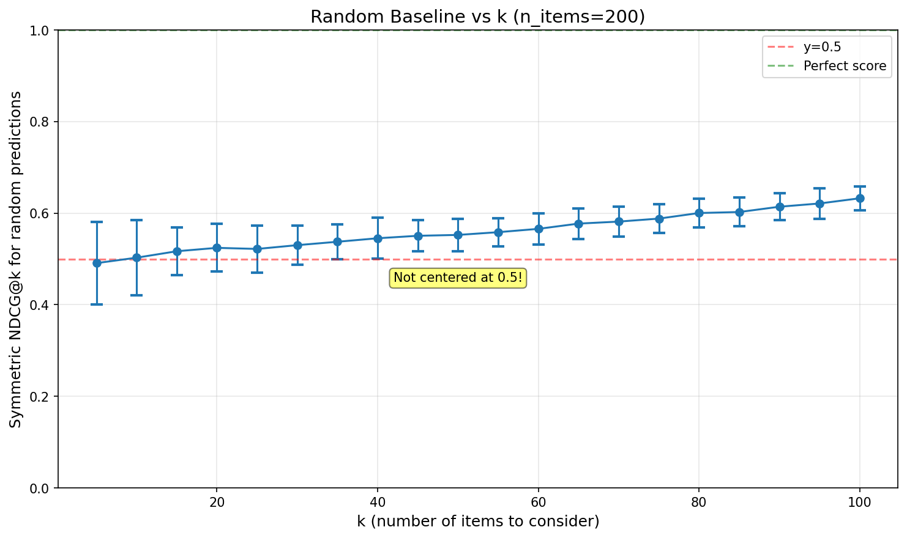

All scoring functions used in the CrowdCent Challenge can be found in the `crowdcent_challenge.scoring` module.

```python
from crowdcent_challenge.scoring import *
```

## Symmetric NDCG@k

One of the key metrics used in some challenges is Symmetric Normalized Discounted Cumulative Gain (Symmetric NDCG@k).

### Concept

**Normalized Discounted Cumulative Gain (NDCG@k)** is a metric used to evaluate how well a model ranks items. It assesses the quality of the top *k* predictions by:

1.  Giving higher scores for ranking truly relevant items higher.
2.  Applying a logarithmic discount to items ranked lower (meaning relevance at rank 1 is more important than relevance at rank 10).
3.  Normalizing the score by the best possible ranking (IDCG) to get a value between 0 and 1.

However, this commonly used metric only focuses on the *top* items in a list. In finance, identifying the *worst* performers (lowest true values) can be just as important as identifying the best.

Our metric of **Symmetric** NDCG@k addresses this by evaluating ranking performance at *both ends* of the list:

1.  **Top Performance:** It calculates the standard `NDCG@k` based on your predicted scores (`y_pred`) compared to the actual true values (`y_true`). This measures how well you identify the items with the highest true values.
2.  **Bottom Performance:** It calculates another `NDCG@k` focused on the lowest ranks. It does this by:
    *   Ranking items based on your *lowest* predicted scores.
    *   Using the *negative* of the true values (`-y_true`) as relevance. This makes the most negative true values the most "relevant" for this bottom-ranking task.
    *   Calculating `NDCG@k` for how well your lowest predictions match the items with the lowest true values.
3.  **Averaging:** The final `symmetric_ndcg_at_k` score is the simple average of the Top NDCG@k and the Bottom NDCG@k. `(NDCG_top + NDCG_bottom) / 2`.

### Calculation

The Symmetric NDCG@k is calculated as:

1. **Top NDCG@k**: Rank items by predicted scores (highest first), calculate NDCG@k using true values as relevance
2. **Bottom NDCG@k**: Rank items by predicted scores (lowest first), calculate NDCG@k using negative true values as relevance
3. **Final Score**: Average of top and bottom NDCG@k scores: `(NDCG_top + NDCG_bottom) / 2`

The standard NDCG formula includes:

- DCG@k = Σ(relevance_i / log₂(i+1)) for i=1 to k
- IDCG@k = DCG@k for ideal ranking
- NDCG@k = DCG@k / IDCG@k

### Interpretation

Notably, Symmetric NDCG@k does not give 0.5 for random predictions, but ~0.55 for our default k=40. Understanding the random baseline is crucial for interpreting your scores.

*   **NDCG@k = 1**: perfect performance at identifying both the top *k* best and bottom *k* worst items according to their true values.
*   **NDCG@k = 0.55**: random guessing.
*   **NDCG@k = 0**: no overlap with top k or bottom k.

**How k Affects the Random Baseline:**

<div style="display: flex; justify-content: space-around; margin: 20px 0;">
  
</div>

Key insights:

- Random baseline starts near 0.5 for small k and increases monotonically
- For Hyperliquid (k=40, n≈170-200), random predictions score ~0.55

### Usage

```python
from crowdcent_challenge.scoring import symmetric_ndcg_at_k
import numpy as np

# Example data
y_true = np.array([0.1, -0.2, 0.5, -0.1, 0.3])
y_pred = np.array([0.2, -0.1, 0.6, 0.0, 0.4])
k = 3

score = symmetric_ndcg_at_k(y_true, y_pred, k)
print(f"Symmetric NDCG@{k}: {score:.4f}")
```

This metric provides a more holistic view of ranking performance when both high and low extremes are important.

## Spearman Correlation

Spearman's rank correlation coefficient is a non-parametric measure of rank correlation that assesses how well the relationship between two variables can be described using a monotonic function.

### Concept

In the context of ranking challenges, **Spearman correlation** measures how well your predicted rankings align with the true rankings. Unlike Pearson correlation (which measures linear relationships), Spearman correlation:

1. **Works with ranks**: It converts both predicted and true values to ranks before computing correlation
2. **Captures monotonic relationships**: Perfect Spearman correlation (±1) means perfect monotonic relationship, even if not linear
3. **Robust to outliers**: Since it uses ranks rather than raw values, extreme values have less influence

### Calculation

The Spearman correlation coefficient (ρ) is calculated as:

- First, convert both `y_true` and `y_pred` to ranks
- Then calculate the Pearson correlation coefficient on these ranks
- Formula: ρ = 1 - (6 × Σd²) / (n × (n² - 1)), where d is the difference between paired ranks

### Interpretation

- **ρ = 1**: Perfect positive correlation (your rankings perfectly match the true rankings)
- **ρ = 0**: No correlation (your rankings are unrelated to the true rankings)  
- **ρ = -1**: Perfect negative correlation (your rankings are exactly reversed)

### Usage

```python
from scipy.stats import spearmanr
import numpy as np

# Example data
y_true = np.array([1.0, 0.5, 0.3, 0.2, 0.1])  # True values (will be ranked)
y_pred = np.array([0.9, 0.6, 0.25, 0.22, 0.05])    # Predicted values (will be ranked)

# Calculate Spearman correlation
correlation, p_value = spearmanr(y_true, y_pred)
print(f"Spearman Correlation: {correlation:.4f}")
```