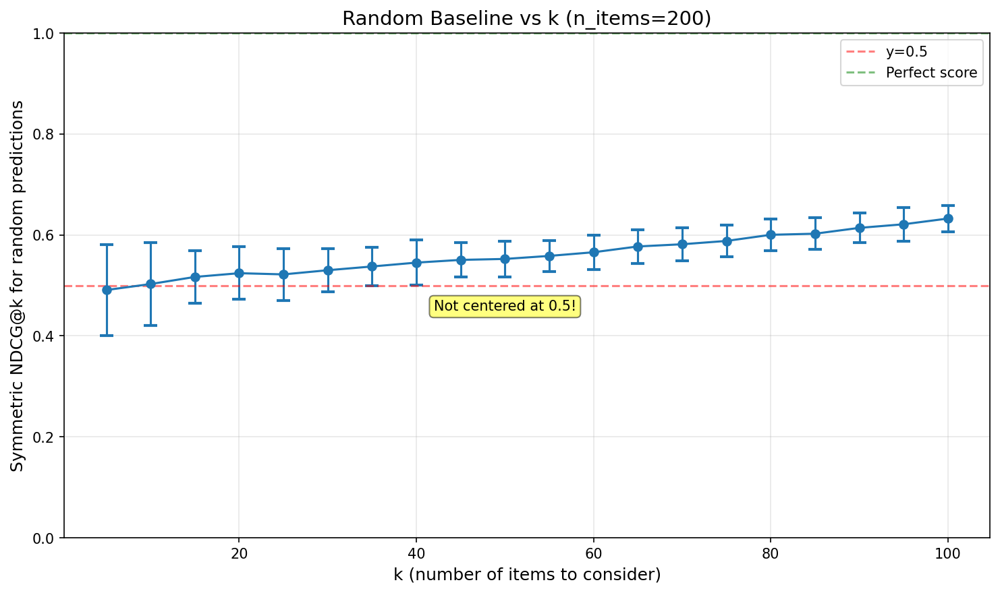

All scoring functions used in the CrowdCent Challenge can be found in the `crowdcent_challenge.scoring` module.

```python
from crowdcent_challenge.scoring import *
```

## Raw Metrics

These metrics measure how well your predictions match the actual outcomes, without considering the meta-model.

### Symmetric NDCG@k (`symmetric_ndcg_at_k`)

One of the key metrics used in some challenges is Symmetric Normalized Discounted Cumulative Gain (Symmetric NDCG@k).

#### Concept

**Normalized Discounted Cumulative Gain (NDCG@k)** is a metric used to evaluate how well a model ranks items. It assesses the quality of the top *k* predictions by:

1.  Giving higher scores for ranking truly relevant items higher.
2.  Applying a logarithmic discount to items ranked lower (meaning relevance at rank 1 is more important than relevance at rank 10).
3.  Normalizing the score by the best possible ranking (IDCG) to get a value between 0 and 1.

However, this commonly used metric only focuses on the *top* items in a list. In finance, identifying the *worst* performers (lowest true values) can be just as important as identifying the best.

Our metric of **Symmetric** NDCG@k addresses this by evaluating ranking performance at *both ends* of the list:

1.  **Top Performance:** It calculates the standard `NDCG@k` based on your predicted scores (`y_pred`) compared to the actual true values (`y_true`). This measures how well you identify the items with the highest true values.
2.  **Bottom Performance:** It calculates another `NDCG@k` focused on the lowest ranks. It does this by:
    *   Inverting both true values and predictions using `1 - value` transformation
    *   This makes originally low values (close to 0) become high values (close to 1), so standard NDCG rewards finding the originally lowest items
    *   Calculating `NDCG@k` for how well your lowest predictions match the items with the lowest true values
3.  **Averaging:** The final `symmetric_ndcg_at_k` score is the simple average of the Top NDCG@k and the Bottom NDCG@k. `(NDCG_top + NDCG_bottom) / 2`.

#### Calculation

The Symmetric NDCG@k is calculated as:

1. **Top NDCG@k**: Calculate standard NDCG@k using true values and predicted scores
2. **Bottom NDCG@k**: Invert both true values and predictions using `1 - value`, then calculate NDCG@k
3. **Final Score**: Average of top and bottom NDCG@k scores: `(NDCG_top + NDCG_bottom) / 2`

The standard NDCG formula includes:

- DCG@k = Σ(relevance_i / log₂(i+1)) for i=1 to k
- IDCG@k = DCG@k for ideal ranking
- NDCG@k = DCG@k / IDCG@k

#### Interpretation

Notably, Symmetric NDCG@k does not give 0.5 for random predictions, but ~0.55 for our default k=40. Understanding the random baseline is crucial for interpreting your scores.

*   **NDCG@k = 1**: perfect performance at identifying both the top *k* best and bottom *k* worst items according to their true values.
*   **NDCG@k = 0.55**: random guessing.
*   **NDCG@k = 0**: no overlap with top k or bottom k.

**How k Affects the Random Baseline:**

<div style="display: flex; justify-content: space-around; margin: 20px 0;">
  
</div>

Key insights:

- Random baseline starts near 0.5 for small k and increases monotonically
- For Hyperliquid (k=40, n≈170-200), random predictions score ~0.55

#### Usage

```python
from crowdcent_challenge.scoring import symmetric_ndcg_at_k
import numpy as np

# Example data
y_true = np.array([0.1, 0.2, 0.9, 0.3, 0.7])
y_pred = np.array([0.2, 0.1, 0.8, 0.4, 0.6])
k = 3

score = symmetric_ndcg_at_k(y_true, y_pred, k)
```

This metric provides a more holistic view of ranking performance when both high and low extremes are important.

### Spearman Correlation (`spearman_correlation`)

Spearman's rank correlation coefficient is a non-parametric measure of rank correlation that assesses how well the relationship between two variables can be described using a monotonic function.

#### Concept

In the context of ranking challenges, **Spearman correlation** measures how well your predicted rankings align with the true rankings. Unlike Pearson correlation (which measures linear relationships), Spearman correlation:

1. **Works with ranks**: It converts both predicted and true values to ranks before computing correlation
2. **Captures monotonic relationships**: Perfect Spearman correlation (±1) means perfect monotonic relationship, even if not linear
3. **Robust to outliers**: Since it uses ranks rather than raw values, extreme values have less influence

#### Calculation

The Spearman correlation coefficient (ρ) is calculated as:

- First, convert both `y_true` and `y_pred` to ranks
- Then calculate the Pearson correlation coefficient on these ranks
- Formula: ρ = 1 - (6 × Σd²) / (n × (n² - 1)), where d is the difference between paired ranks

#### Interpretation

- **ρ = 1**: Perfect positive correlation (your rankings perfectly match the true rankings)
- **ρ = 0**: No correlation (your rankings are unrelated to the true rankings)  
- **ρ = -1**: Perfect negative correlation (your rankings are exactly reversed)

#### Usage

```python
from crowdcent_challenge.scoring import spearman_correlation
import numpy as np

# Example data
y_true = np.array([1.0, 0.5, 0.3, 0.2, 0.1])  # True values (will be ranked)
y_pred = np.array([0.9, 0.6, 0.25, 0.22, 0.05])    # Predicted values (will be ranked)

score = spearman_correlation(y_true, y_pred)
```

## Uniqueness Metrics

In addition to measuring how accurate your predictions are, we also measure how *unique* they are relative to the meta-model. If everyone submits the same signal, the meta-model gains nothing. Uniqueness metrics quantify the additional value your predictions bring beyond what the crowd already knows.

Uniqueness metrics are only computed when a meta-model is available for the inference period.

All uniqueness scoring functions are in the `crowdcent_challenge.scoring` module:

```python
from crowdcent_challenge.scoring import (
    neutralize_predictions,
    unique_ndcg,
    unique_spearman,
    corr_to_meta
)
```

### Neutralization (`neutralize_predictions`)

#### Concept

Neutralization is the mathematical building block behind uniqueness scoring. It removes the component of your predictions that's explained by the meta-model, leaving only the **orthogonal residual** -- the part of your signal the meta-model doesn't already capture.

Intuitively: if your predictions are 80% meta + 20% your own alpha, neutralization strips away the 80% and isolates the 20%.

#### Calculation

The process uses ordinary least-squares regression:

1. Regress your predictions against the meta-model predictions (with an intercept)
2. Subtract the fitted values from your predictions
3. The residual is your unique signal

$$
\text{residual} = y_{\text{pred}} - (\beta_1 \cdot \text{meta\_pred} + \beta_0)
$$

#### Interpretation

The residual has zero correlation with the meta-model by construction. Larger residual variance means more unique signal. If your predictions are nearly identical to the meta, the residual will be near-zero noise.

#### Usage

```python
from crowdcent_challenge.scoring import neutralize_predictions

residual = neutralize_predictions(y_pred=my_preds, meta_pred=meta_preds)
# residual is uncorrelated with meta_preds by construction
```

### Unique NDCG@40 (`unique_ndcg`)

#### Concept

Measures whether your unique signal correctly identifies the top and bottom k assets. This combines neutralization and Symmetric NDCG@k: first your predictions are neutralized against the meta-model, then Symmetric NDCG@k is computed between the residual and `y_true`.

#### Calculation

1. Neutralize `y_pred` against `meta_pred` using OLS regression (see [Neutralization](#neutralization-neutralize_predictions) above)
2. Compute Symmetric NDCG@k between the residual and `y_true` (see [Symmetric NDCG@k](#symmetric-ndcgk-symmetric_ndcg_at_k) for details)

#### Interpretation

- **Range:** 0 to 1
- **~0.55:** Random (same baseline as raw NDCG@40, since the underlying metric is the same)
- **> 0.55:** Your unique signal has predictive ranking quality at the extremes

#### Usage

```python
from crowdcent_challenge.scoring import unique_ndcg

score = unique_ndcg(y_true=actuals_10d, y_pred=my_preds_10d, meta_pred=meta_preds_10d, k=40)
```

### Unique Spearman (`unique_spearman`)

#### Concept

Measures whether your unique signal has predictive rank correlation with the actual outcomes. This combines neutralization and Spearman correlation in one step: first your predictions are neutralized against the meta-model, then Spearman correlation is computed between the residual and `y_true`.

#### Calculation

1. Neutralize `y_pred` against `meta_pred` using OLS regression (see [Neutralization](#neutralization-neutralize_predictions) above)
2. Compute Spearman rank correlation between the residual and `y_true`

#### Interpretation

- **Range:** -1 to +1
- **Positive:** Your unique signal adds predictive value beyond the meta
- **Zero:** Your unique signal is noise
- **Negative:** Your unique signal is counter-predictive

Values of 0.02-0.05 are meaningful given the noise in financial data.

#### Usage

```python
from crowdcent_challenge.scoring import unique_spearman

score = unique_spearman(y_true=actuals_10d, y_pred=my_preds_10d, meta_pred=meta_preds_10d)
```

### Correlation to Meta (`corr_to_meta`)

#### Concept

Measures how aligned your predictions are with the meta-model using Spearman rank correlation. This is a direct similarity measure -- it tells you *how much* your signal overlaps with the crowd.

Unlike the other uniqueness metrics, this does not require `y_true` -- it is purely a comparison between your predictions and the meta-model. Computed separately for each horizon (10d, 30d).

#### Calculation

Spearman rank correlation between `y_pred` and `meta_pred`. Both vectors are converted to ranks, then Pearson correlation is computed on the ranks (see [Spearman Correlation](#spearman-correlation-spearman_correlation) above for details).

#### Interpretation

- **+1:** Identical to meta (no unique information)
- **0:** Orthogonal to meta (maximally differentiated)
- **-1:** Exact inverse of meta

!!! tip "Lower is more unique"
    Unlike raw metrics where higher is better, for `corr_to_meta` a value closer to **zero** indicates more unique predictions. However, being unique alone isn't enough -- your unique signal also needs to be *predictive*.

#### Usage

```python
from crowdcent_challenge.scoring import corr_to_meta
import numpy as np

# Your predictions vs the meta-model for the same horizon
similarity = corr_to_meta(y_pred=my_preds_10d, meta_pred=meta_preds_10d)
# similarity ≈ 0.7 means you share ~70% of the meta's ranking signal
```