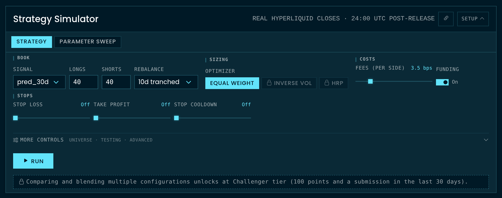
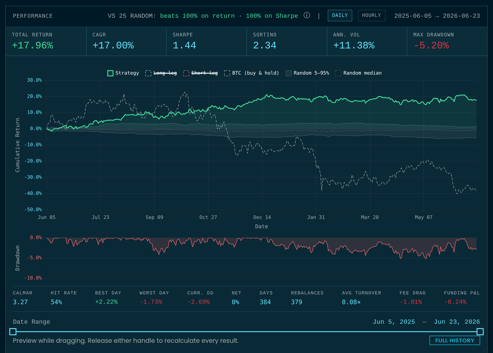

# The Simulator

The [Simulator](https://crowdcent.com/challenge/hyperliquid-ranking/meta-model/simulation/) evaluates the [meta-model](hyperliquid-ranking.md#meta-model)'s aggregate predictions as simulated long/short perpetual-futures portfolios over historical Hyperliquid market data. It allows you to test portfolio construction rules, optimizers, rebalancing frequencies, and market frictions against the community signal.

You can use the Simulator interactively in your browser without writing code, or programmatically through the Python client, the `crowdcent sim` CLI, and MCP tools.

## Run your first backtest in the browser

1. Open the meta-model’s **Simulation** tab and stay on **Strategy**.
2. Choose a **Signal**, the number of **Longs** and **Shorts**, a **Rebalance** cadence, and an **Optimizer**. Review fees and funding before running.
3. Select **Run**, then read the performance chart together with its date range, drawdown, and costs. The chain-link icon beside **Strategy Simulator** copies a link to your configuration.

<figure class="doc-screenshot" markdown>
[{ loading=lazy width="1110" height="438" }](https://crowdcent.com/challenge/hyperliquid-ranking/meta-model/simulation/){ target="_blank" rel="noopener" title="Open this page on CrowdCent" }
<figcaption>Set the signal, long and short counts, rebalance cadence, and optimizer. Review fees, funding, and stops before selecting <strong>Run</strong>.</figcaption>
</figure>

## Portfolio construction knobs

The simulator supports several configuration parameters:

- **Cohort sizing (`n_long`, `n_short`)**: Number of top-ranked assets bought long and bottom-ranked assets sold short (1 to 100 names per leg).
- **Cadence and rolling tranches (`rebalance_days`)**: Rebalancing intervals of `1`, `5`, `10`, or `30` days. Values ending in `t` (`5t`, `10t`, or `30t`) use tranched rolling vintages. Tranched execution splits the portfolio into equal daily sub-cohorts to eliminate single-day rebalance timing luck.
- **Optimizers (`optimizer`)**: `equal` (equal dollar allocation across assets), `inv_vol` (inverse 30-day volatility, Challenger tier), or `hrp` (Hierarchical Risk Parity, Challenger tier). Higher tiers unlock covariance optimizers and conviction-weighted sizing; the API's capabilities endpoint lists the optimizer keys and knobs your tier unlocks.
- **Frictions and carry costs (`include_funding`, `fee_bps`, `impact_book`)**: Incorporates hourly perpetual funding rates (on by default), exchange transaction fees (0 to 20 bps per side, 3.5 by default), and order book market impact models for an assumed book size.
- **Sizing (`leverage`, `target_vol`)**: One decision on the whole book, separate from its shape, so it is never a config knob: `run_simulation` and `run_blend` take `leverage` and `target_vol` beside the config, and a config that names them is rejected. `leverage` (0.25 to 3.0, default 1.0) is the gross book as a multiple of equity. A vol target (`target_vol`, annualized, 0 = off) adapts the multiple to hold realized volatility near the target, never above `leverage`, so the two compose as a ceiling, not a product. The response echoes the pair as `sizing` (clamped to natural below Contender, with the knobs named in `locked`). Leverage is not free in the backtest: funding, fees and impact scale with gross, and a book whose gross drifts past the venue's maintenance margin (6x equity, the modal Hyperliquid perp) is liquidated, booked as a total loss and reported as `liquidated_on` in the stats.
- **Risk and liquidity filters**: Optimizer risk window (`risk_lookback`: 10 to 365 days of trailing returns, 0 = per-optimizer default), signal lag (`signal_lag`, 0 to 14 days), minimum open interest (`min_oi`), and minimum daily trading volume (`min_volume`). Continuous knobs snap to the step the capabilities listing reports.

## Evaluation metrics and reports

<figure class="doc-screenshot" markdown>
[{ loading=lazy width="1110" height="795" }](https://crowdcent.com/challenge/hyperliquid-ranking/meta-model/simulation/){ target="_blank" rel="noopener" title="Open this page on CrowdCent" }
<figcaption>Read <strong>Sharpe</strong> alongside <strong>Max drawdown</strong>, the return path, and the random-portfolio comparison. These are hypothetical results on the displayed historical window, not live trading returns.</figcaption>
</figure>

Every backtest produces performance metrics split between full-period, in-sample (`is_stats`), and out-of-sample holdout (`oos_stats`) data:

- **Core statistics**: Annualized Sharpe ratio, Sortino ratio, CAGR, maximum drawdown, annualized volatility, and average gross. A path that reached zero equity (`ruined_on`) or was liquidated (`liquidated_on`) reports total return and drawdown only; its annualized ratios are withheld.
- **Optional breakdown series (`include`)**: Daily NAV curve (`curve`), current target weights (`holdings`), monthly returns table (`monthly`), and per-asset P&L attribution (`contributions`).
- **Null benchmarks (`benchmark_trials`)**: Compares strategy performance against up to 100 random-ranking portfolios with identical construction rules to test whether returns exceed chance.

## Parameter sweeps and multi-sleeve blends

- **Parameter sweeps (`run_sweep`)**: Evaluates a grid of configurations (e.g., testing multiple cohort sizes against different rebalance cadences). When analyzing sweep results, look for stable parameter plateaus across out-of-sample data rather than isolated point peaks.
- **Multi-sleeve blends (`run_blend`)**: Nets several weighted simulation configurations into one book, marked as one account (offsetting positions cancel before they are charged), and returns an inter-sleeve correlation matrix. Sizing belongs to the blend, not its sleeves: sleeves run at natural gross, weights shape the blend, and the netted book is sized once by the call's own `leverage` and `target_vol` (the web chart's Sizing row under the charted configurations is the same pair).

## Tier unlocks and parameter clamping

Simulator capabilities scale with your [CC Points](points-system.md) tier:

| Tier | Simulator features |
|---|---|
| Everyone | Backtesting on 90-day delayed meta-model data |
| **Challenger** (100+ points) | Real-time meta-model data*, Inverse-Vol & HRP optimizers, parameter sweeps |
| **Contender** (500+ points) | Covariance optimizers, leverage and volatility targeting, market impact scaling, expanded sweep (up to 96 cells) and blend budgets (up to 5 sleeves) |
| **Centurion** (1,500+ points) | Conviction-weighted sizing and classified alpha controls |

*Real-time meta-model data at any tier requires a submission in the last 30 days. Without one, data falls back to a 90-day delay.

If a configuration specifies a parameter above your current tier, the server automatically clamps the value to your highest accessible tier rather than failing the request. Clamped parameters are listed in the `locked` field of the response.

## Quickstart

=== "Python"

    ```python
    from crowdcent_challenge import ChallengeClient

    client = ChallengeClient("hyperliquid-ranking")

    # 1. Backtest a single configuration
    result = client.run_simulation(
        config={
            "n_long": 10,
            "n_short": 10,
            "optimizer": "inv_vol",
            "rebalance_days": "10t",
            "include_funding": True,
        },
        include=["curve", "holdings"],
        benchmark_trials=25,
    )

    print(f"In-sample Sharpe: {result['is_stats']['sharpe']:.2f}")
    print(f"Out-of-sample Sharpe: {result['oos_stats']['sharpe']:.2f}")
    print(f"Web URL: {result['web_url']}")

    # 2. Grid-search across multiple parameters
    sweep = client.run_sweep(
        config={"n_short": 10, "optimizer": "inv_vol", "include_funding": True},
        sweep={"n_long": [5, 10, 20], "rebalance_days": ["5t", "10t", "30t"]},
    )

    for cell in sweep["results"]:
        print(cell["params"], "OOS Sharpe:", cell["oos_stats"]["sharpe"])

    # 3. Blend weighted sleeves into an ensemble portfolio
    blend = client.run_blend(
        sleeves=[
            {
                "config": {"n_long": 5, "n_short": 10, "rebalance_days": "30t"},
                "weight": 0.6,
                "label": "Slow Trend",
            },
            {
                "config": {"n_long": 10, "n_short": 10, "rebalance_days": "5t"},
                "weight": 0.4,
                "label": "Fast Rebalance",
            },
        ]
    )

    print("Composite Sharpe:", blend["stats"]["sharpe"])
    print("Sleeve Correlations:", blend["correlation"])
    ```

=== "CLI"

    ```bash
    # 0. The knobs and values your tier allows
    crowdcent sim capabilities

    # 1. Backtest a single configuration
    crowdcent sim run \
      --config '{"n_long": 10, "n_short": 10, "optimizer": "inv_vol", "rebalance_days": "10t", "include_funding": true}' \
      --include curve --include holdings --benchmark-trials 25

    # 2. Grid-search across multiple parameters
    crowdcent sim sweep \
      --config '{"n_short": 10, "optimizer": "inv_vol", "include_funding": true}' \
      --sweep '{"n_long": [5, 10, 20], "rebalance_days": ["5t", "10t", "30t"]}'

    # 3. Blend weighted sleeves into an ensemble portfolio (JSON from a file)
    crowdcent sim blend --sleeves @sleeves.json
    ```

## Deploying to live trading

Once a portfolio strategy has been evaluated in the Simulator, you can deploy it as a mandate on Hyperliquid using [Live Trading](live-trading.md) (Challenger tier and above).

!!! warning "Simulator Disclaimer"
    Simulations are provided for informational and educational purposes only. Not financial, investment, or trading advice. Simulated performance is not indicative of future results. Perpetual futures are leveraged instruments and you can lose your entire margin. See the full [disclaimer](disclaimer.md).
